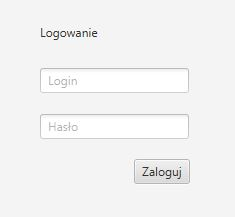
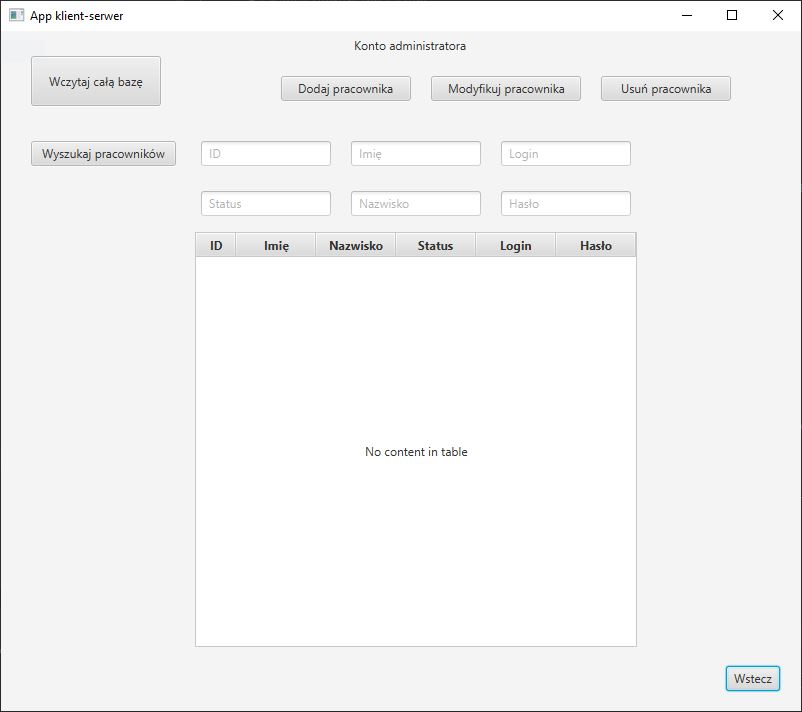
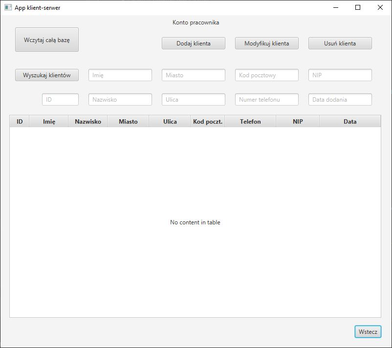

# GraduationWorkApp_Client

## Table of contents
* [General info](#general-info)
* [Technologies](#technologies)
* [Screenshots](#screenshots)
* [Launch](#launch)
* [Features](#features)
* [To-do](#to-do)
* [Project status](#project-status)

## General info
This is application of simple project client-server. It send CRUD requests to the server's application.

## Technologies
Project is created with:
* Java version: 8 (1.8.0_221)
* JavaFX version: 8.0.201-b08
* Maven version: 3.6.3
* Spring Boot version: 2.3.1.RELEASE
* Hibernate
* MySQL version: 8.0.20
* REST
* JSON
* MVC pattern

## Screenshots

Login window:\

Admin window:\

Employee window:\

## Launch
Unpack the project. Start the server application and later run the client application.

## Features
* Employee login
* CRUD requests
* Searching the database

## To-do
* Adding CSS styles
* Improving the login process
* Addition of Spring Security
* Adding the administrator the ability to CRUD operations on clients
* Database improvement
* Adding multithreading

## Project status
It's currently completed.